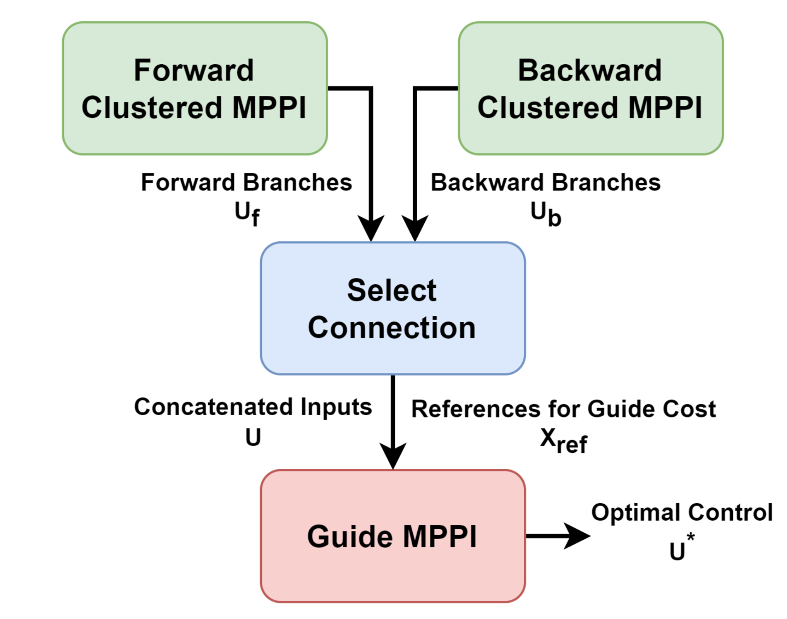
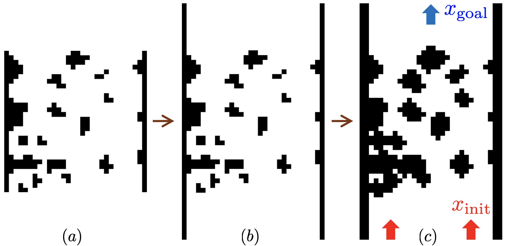

# BiC-MPPI

Implementation of the BiC-MPPI (Bidirectional Clustering Model Predictive Path Integral) in C++.

<video controls>
  <source src="doc/Bi_MPPI_Video_Test_comp.mp4" type="video/mp4">
  Your browser does not support the video tag.
</video>




## Preparation

### Dependancy
**EigenRand** needs to be named as same as in CMakeLists.txt.
- [Eigen 3.3.9](https://gitlab.com/libeigen/eigen/-/releases/3.3.9)
- [EigenRand](https://github.com/bab2min/EigenRand)
- [OpenMP](https://www.openmp.org/)

### Map Download and Modification
```bash
git clone https://github.com/i-ASL/BiC-MPPI.git
cd BiC-MPPI
```

Please download **BARN_dataset/grid_files** from [BARN_dataset](https://www.cs.utexas.edu/~xiao/BARN/BARN.html)
```bash
cd BARN_dataset
python3 npy_to_txt.py
```



Map modification in the BARN dataset with extended boundaries and inflated obstacles
## Usage
### Point-mass quadrotor landing problem
```bash
cd BiC-MPPI
mkdir build && cd build
cmake.. -Dquadrotor=1 && make
./bi_mppi   # or other variants (mppi, log_mppi, cluster_mppi)
```
|                  |  Native  | Log-MPPI | Cluster-MPPI | BiC-MPPI (ours) |
|:----------------:|:--------:|:--------:|:------------:|:---------------:|
| **No. Sim.**     |    300   |    300   |      300     |       300       |
| **No. Failure**  |    78    |   170    |      81      |       10        |
| **Avg. Iter.**   |  82.302  | 99.946   |    84.954    |     35.866      |
| **Avg. Time [s]**|  5.642   | 10.437   |    7.768     |      2.456      |
| **Avg. Err (x, y)**|  2.105   | 6.592    |    2.011     |      0.531      |
| **Q1**           |  0.773   | 4.500    |    0.829     |      0.263      |
| **Q2**           |  1.367   | 6.604    |    1.359     |      0.433      |
| **Q3**           |  2.694   | 8.821    |    2.490     |      0.692      |

Q1, Q2, Q3 represent the quantiles of error (x, y), respectively.

### Wheeled mobile robot moving
```bash
cd BiC-MPPI
mkdir build && cd build
cmake.. -Dquadrotor=0 && make
./bi_mppi   # or other variants (mppi, log_mppi, cluster_mppi)
```
|                  | MPPI          | Log-MPPI      | Cluster-MPPI | BiC-MPPI (ours) |
|:----------------:|:--------:|:--------:|:------------:|:---------------:|
| **No. Sim.**     | 600           | 600           | 600          | 600             |
| **No. Failure**  | 117           | 107           | 119          | 79              |
| **Success Rate** | 0.805         | 0.822         | 0.802        | 0.868           |
| **Avg. Iter.**   | 101.650       | 103.919       | 101.004      | 88.198          |
| **Avg. Time [s]**| 2.766         | 4.161         | 7.356        | 3.346           |
